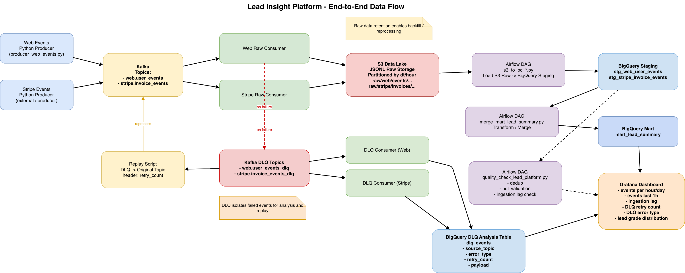

# Job Postings Data Platform

## 1. 프로젝트 개요

Job Postings Data Platform은 여러 채용 사이트의 공고 데이터를 수집하여 S3 데이터 레이크에 저장하고, BigQuery에서 정제·분석할 수 있도록 구축한 채용공고 수집 기반 데이터 파이프라인 프로젝트입니다.

이 프로젝트의 목표는 단순히 HTML을 수집하는 수준을 넘어서, **수집 → 저장 → 정제 → 품질 검증 → 모니터링 → 장애 복구**까지 포함한 실제 데이터 플랫폼의 전체 흐름을 직접 설계하고 구현하는 것이었습니다.

현재 파이프라인은 다음과 같은 채용공고 소스를 처리합니다.

- Wanted
- GroupBy
- Catch
- (확장 가능: Saramin, JobKorea 등)

Kafka 기반 큐를 통해 수집 요청과 처리 단계를 분리했고, Worker가 공고 페이지를 fetch하여 S3에 raw / processed / curated 형태로 저장하도록 구성했습니다. 또한 DLQ와 Replay 메커니즘을 통해 실패한 fetch 작업을 복구할 수 있도록 설계했으며, Airflow를 사용해 BigQuery 적재 및 품질 검증을 수행하고 Grafana를 통해 운영 상태를 모니터링합니다.

---

## 2. 프로젝트 목표

이 프로젝트는 채용공고 수집 파이프라인을 직접 운영한다고 가정했을 때, 데이터 엔지니어가 실제로 고려해야 하는 문제들을 경험해보기 위해 시작되었습니다.

핵심 질문은 다음과 같았습니다.

- 채용공고 수집 요청은 안정적으로 처리되는가?
- fetch 실패는 어떻게 분리하고 복구할 수 있는가?
- 같은 공고가 중복 적재되지는 않는가?
- 원본과 정제 데이터를 어떻게 분리해 관리할 것인가?
- 파이프라인 상태를 어떻게 모니터링할 것인가?

이를 해결하기 위해 다음과 같은 기술과 구조를 사용했습니다.

- Kafka 기반 fetch job 큐
- Python Worker 기반 HTML 수집
- Amazon S3 Data Lake
- BigQuery Data Warehouse
- Airflow 기반 적재 및 Data Quality Check
- Grafana Monitoring
- DLQ + Replay 시스템
- At-least-once 처리 환경에서의 중복 방지 / 정제 전략

---

## 3. 시스템 아키텍처

전체 데이터 파이프라인 구조는 다음과 같습니다.



---

## 4. 사용 기술 (Tech Stack)

### Data Ingestion
- Kafka

### Data Collection / Processing
- Python Worker
- Requests
- boto3

### Data Storage
- Amazon S3 (Data Lake)
- BigQuery (Data Warehouse)

### Orchestration
- Airflow

### Monitoring
- Grafana

### Reliability
- DLQ (Dead Letter Queue)
- Replay Mechanism
- At-least-once processing
- Worker-level idempotency
- BigQuery-level deduplication

---

## 5. 데이터 흐름 (Data Flow)

## 1. 채용공고 수집 요청 생성

수집 대상 채용공고 URL을 Kafka fetch topic에 넣습니다.

예시 입력 데이터:

- 공고 URL
- source
- collected_at
- job_id
- retry_count

이 데이터는 Worker가 실제 공고 페이지를 수집하기 위한 fetch job 역할을 합니다.

---

## 2. Kafka fetch topic 적재

생성된 수집 요청은 Kafka topic으로 전송됩니다.

예시 topic:

- `job_postings.fetch_jobs`

Kafka는 수집 요청 생성 단계와 실제 HTML 수집 단계를 분리하는 역할을 합니다.

이를 통해 다음과 같은 장점을 얻을 수 있습니다.

- 수집 요청과 처리 속도 분리
- Worker 장애 시 메시지 유실 완화
- 비동기 처리 구조
- Replay 및 DLQ 기반 복구 가능

---

## 3. Worker 기반 HTML 수집

Worker는 Kafka에서 fetch job을 읽고, 해당 URL의 HTML을 수집합니다.

수집 과정에서 다음을 수행합니다.

- HTTP 요청 수행
- source별 HTML 메타데이터 추출
- canonical URL 재요청 처리 (예: Saramin)
- fetch 실패 시 DLQ 전송
- raw / processed / curated 문서 생성

---

## 4. S3 Data Lake 저장

Worker는 수집 결과를 S3에 다음 3개 레이어로 저장합니다.

### Raw
수집한 HTML 원문 저장

예시:
- `raw/job_postings/source={source}/dt={dt}/{job_id}.html`

### Processed
원본 HTML의 기본 메타데이터 저장

예시:
- `processed/job_postings/source={source}/dt={dt}/{job_id}.json`

### Curated
정제된 공고 문서 저장

예시:
- `curated/job_postings/dt={dt}/{job_id}.json`

이 구조는 다음과 같은 목적을 가집니다.

- 원본 데이터 보존
- 단계별 산출물 분리
- 장애 복구 및 재처리 기준점 제공
- 정제 로직 변경 시 raw 기반 재처리 가능

---

## 5. 실패 이벤트 처리 (DLQ)

fetch / raw upload / processed 생성 / curated 생성 단계에서 오류가 발생하면, 해당 job은 DLQ topic으로 전송됩니다.

예시 DLQ topic:

- `job_postings.dlq`

DLQ 메시지에는 다음 정보가 포함됩니다.

- job payload
- error_type
- error_message
- failed_stage
- failed_at
- retry_count

이 구조를 통해 어떤 단계에서 왜 실패했는지 추적할 수 있습니다.

---

## 6. Replay 시스템

DLQ에 저장된 fetch 실패 job은 replay script를 통해 다시 원래 fetch topic으로 전송할 수 있습니다.

흐름:

DLQ Topic  
↓  
Replay Script / Airflow Replay DAG  
↓  
Original Fetch Topic

재처리 조건:
- `failed_stage == "fetch"`
- `retry_count < MAX_RETRY_COUNT`

이를 통해 일시적인 네트워크 장애나 외부 사이트 응답 문제를 복구할 수 있습니다.

---

## 7. BigQuery 데이터 적재

S3에 저장된 curated 데이터는 BigQuery staging 테이블로 적재됩니다.

현재 사용 중인 주요 테이블:

- `stg_job_postings`

이 단계에서는 Worker가 생성한 정제 문서를 테이블 형태로 적재하여 downstream 정제와 분석의 입력으로 사용합니다.

---

## 6. 데이터 모델 (Data Model)

데이터 웨어하우스는 다음 계층 구조로 구성했습니다.

Raw Files (S3)  
│  
▼  
Staging Table  
│  
▼  
Intermediate / Clean View  
│  
▼  
Mart Views

---

## Staging Layer

정제된 공고 문서를 BigQuery에 적재하는 레이어입니다.

### stg_job_postings

| column | description |
|------|-------------|
| posting_id | 공고 수집 작업 ID |
| source | 수집 소스 |
| original_url | 원본 공고 URL |
| company_name | 회사명 |
| title | 공고 제목 |
| location | 근무 지역 |
| employment_type | 고용 형태 |
| experience_level | 경력 수준 |
| description_text | 공고 설명 텍스트 |
| skills | 스킬 정보 |
| collected_at | 수집 시각 |
| content_hash | 공고 설명 기반 해시 |
| raw_s3_key | raw HTML 경로 |
| processed_s3_key | processed JSON 경로 |
| curated_s3_key | curated JSON 경로 |
| loaded_at | BigQuery 적재 시각 |

---

## Intermediate Layer

최종 중복 제거 및 최신 공고 기준 정제를 수행하는 레이어입니다.

### int_job_postings_clean

현재 중복 제거 기준은 다음과 같습니다.

- `source + original_url` 기준으로 그룹화
- `collected_at DESC`, `loaded_at DESC` 기준 최신 1건만 유지

즉 같은 source 내 동일 URL에 대해 최신 공고만 남깁니다.

---

## Mart Layer

운영 및 분석에 바로 사용할 수 있도록 요약한 레이어입니다.

### mart_job_postings_daily
일별 / 소스별 공고 수집량 집계

### mart_job_postings_source_quality
소스별 품질 지표 집계

예시 지표:
- total_postings
- description_filled_count
- content_hash_filled_count
- missing_title_count
- missing_company_count

---

## 7. 데이터 품질 검증 (Data Quality)

데이터 파이프라인의 신뢰성을 유지하기 위해 다음 검증을 수행합니다.

### 1. Deduplication

같은 공고가 반복 수집될 수 있으므로, BigQuery intermediate 레이어에서 최신 1건만 남깁니다.

```sql
SELECT
  posting_id,
  source,
  original_url
FROM (
  SELECT
    *,
    ROW_NUMBER() OVER (
      PARTITION BY source, original_url
      ORDER BY collected_at DESC, loaded_at DESC
    ) AS rn
  FROM `lead-insight-platform.lead_platform.stg_job_postings`
)
WHERE rn = 1
```

### 2. Required Field Validation

핵심 필드 누락 여부를 검증합니다

```sql
SELECT COUNT(*)
FROM `lead-insight-platform.lead_platform.int_job_postings_clean`
WHERE title IS NULL
   OR original_url IS NULL
   OR source IS NULL
   OR collected_at IS NULL
```

### 3. Description Quality Check

설명 텍스트가 비어 있는 공고 비율을 점검합니다.

```sql
SELECT
  source,
  total_postings,
  description_filled_count
FROM `lead-insight-platform.lead_platform.mart_job_postings_source_quality`
```

### 4. Content Hash Monitoring

content_hash 는 현재 직접 dedup 키로 사용하지는 않지만,
동일/유사 공고 후보를 관찰하기 위한 품질 지표로 활용합니다.

## 8. Monitoring

Grafana 대시보드를 통해 채용공고 수집 파이프라인 상태를 모니터링합니다.

주요 지표:
	•	Job Postings Volume
	•	Source별 공고 수집량
	•	DLQ Events
	•	retry_count 분포
	•	error_type 분포
	•	failed_stage 분포
	•	description quality
	•	적재량 추이

특히 replay 결과 자체는 Airflow가 실행하고,
실패 패턴과 운영 상태는 BigQuery + Grafana에서 모니터링하도록 분리했습니다.

즉,
	•	Airflow = orchestration
	•	BigQuery / Grafana = observability

역할로 나누어 구성했습니다.

## 9. Lessons Learned

### 1. 채용공고 수집에서 중요한 것은 단순 fetch 성공이 아니라 복구 가능성

초기에는 공고 HTML을 잘 가져오는 것 자체에 집중했지만, 실제 운영 관점에서는 다음 문제가 더 중요했습니다.
	•	외부 사이트 응답 실패
	•	DNS / timeout / SSL 오류
	•	동일 공고 중복 수집
	•	실패한 작업의 재처리
	•	어떤 단계에서 실패했는지 추적 가능성

이를 해결하기 위해 다음을 설계했습니다.
	•	DLQ
	•	Replay System
	•	failed_stage / error_type 기록
	•	retry_count 기반 재시도 제한

### 2. 중복 제거는 한 지점이 아니라 여러 레이어에서 나뉘어야 한다

현재 파이프라인은 다음과 같은 다층 구조를 사용합니다.
	•	Worker: job_id 기반 재처리 방지
	•	BigQuery intermediate: source + original_url 기준 dedup
	•	Mart: dedup 결과 기반 집계

즉 raw는 보존하고, 정제 레이어에서 신뢰 가능한 공고만 남기는 구조를 사용했습니다.

### 3. 원본 보존과 분석용 정제는 분리해야 한다

raw / processed / curated 를 분리해 저장함으로써 다음 장점을 얻었습니다.
	•	원본 HTML 보존
	•	정제 로직 변경 시 재처리 가능
	•	단계별 디버깅 가능
	•	데이터 품질 문제 발생 시 역추적 가능

⸻

### 4. 운영에서는 실행과 관측을 분리하는 것이 중요하다

Replay 실행 자체는 Airflow에서 담당하고,
재처리 결과 및 실패 패턴 검증은 dlq_events 를 BigQuery에 적재한 뒤 Grafana에서 모니터링하도록 구성했습니다.

이를 통해 다음 역할을 분리했습니다.
	•	Airflow: 스케줄링 및 재처리 실행
	•	BigQuery / Grafana: 운영 상태 관측 및 실패 패턴 분석

⸻

### 5. 데이터 플랫폼에서 중요한 것은 적재 자체보다 신뢰성이다

이 프로젝트를 통해 단순 적재보다 더 중요한 것이 무엇인지 체감할 수 있었습니다.
	•	실패 이벤트 격리
	•	중복 방지
	•	품질 검증
	•	재처리 가능성
	•	운영 모니터링

결국 데이터 플랫폼의 핵심은 “데이터가 들어오느냐”가 아니라
“문제가 생겨도 신뢰할 수 있게 운영되느냐” 라는 점을 배웠습니다.
